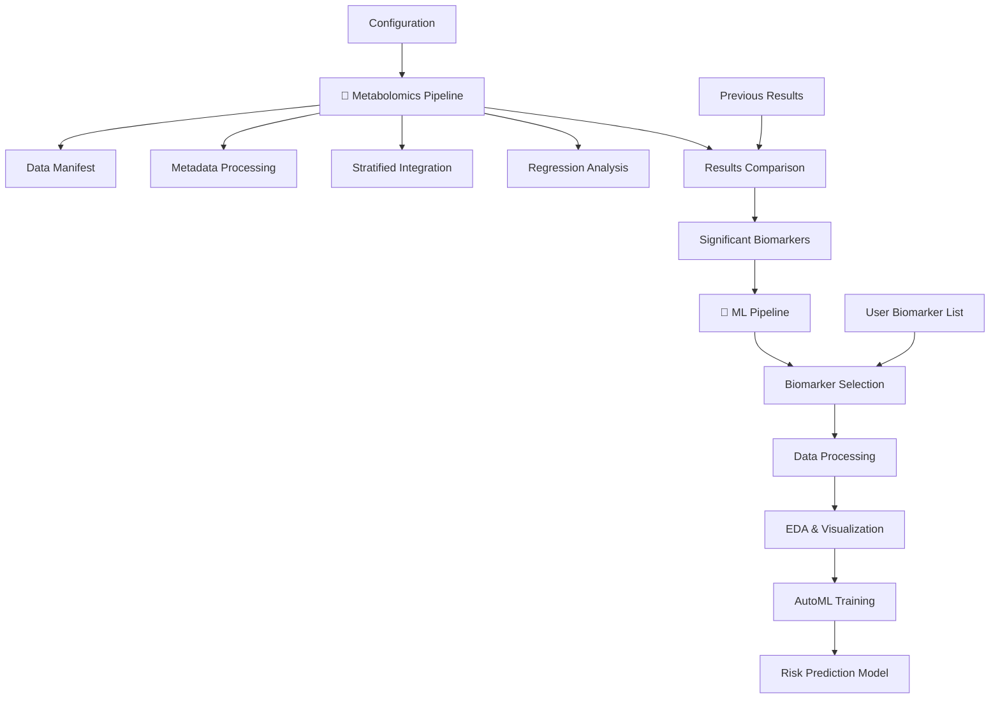

# Metabolomic Analysis Pipeline

A comprehensive, scalable analysis platform with **two specialized pipelines** for maternal metabolomics research. Built on PySpark for distributed processing, this system enables end-to-end analysis from biomarker discovery to risk prediction.

## Overview

This repository contains **two distinct but integrated pipelines**:

### 🔬 **Metabolomics Pipeline** - Biomarker Discovery
Identifies significant biomarkers associated with maternal outcomes:
- Data ingestion and quality control
- Multi-site metadata processing and integration  
- Distributed statistical analysis with multiple testing correction
- Results validation against previous analyses

### 🤖 **Machine Learning Pipeline** - Risk Prediction
Builds predictive models using discovered biomarkers:
- **User-controllable biomarker selection** (specify your own list or use auto-selection)
- Advanced feature engineering and preprocessing
- AutoML model optimization with cross-validation
- Comprehensive model evaluation and interpretation

### 📊 **Supported Outcomes**
Both pipelines support analysis of five key maternal outcomes:
- **EOPE** - Early-onset preeclampsia
- **LOPE** - Late-onset preeclampsia  
- **SB** - Stillbirth
- **PTB** - Preterm birth
- **SGA** - Small for gestational age

This modular design enables researchers to run biomarker discovery independently, use existing biomarkers for prediction, or execute the complete end-to-end workflow.

## Features

### 🚀 **Scalable Architecture**
- **PySpark Backend**: Distributed processing for large datasets
- **Delta Lake Integration**: Optimized storage and versioning
- **Databricks Ready**: Seamless cluster deployment
- **Memory Optimization**: Efficient caching and partitioning

### 🔧 **Dual-Pipeline Architecture**
- **Separate Pipelines**: Independent metabolomics and ML workflows
- **Biomarker Selection Interface**: User-specified or automatic biomarker selection
- **Configurable Workflows**: Outcome-specific parameterization for all 5 outcomes
- **Future-Ready Design**: Easy to add new pipeline types in `/pipelines/` directory
- **Capybara Utilities**: Personal statistical library replacing external dependencies

### 📊 **Analysis Capabilities**
- **Multi-site Integration**: Harmonizes data across research sites
- **Metadata Processing**: Advanced imputation and filtering
- **Statistical Analysis**: Logistic regression with multiple testing correction
- **Visualization**: Comprehensive plotting and QC reports
- **Results Comparison**: Validation against previous analyses

## Architecture

### 🏗️ **Dual-Pipeline Structure**
```
metabolomic_analysis/
├── config/                          # Pipeline configurations
│   ├── metabolomics_config.yaml     # Biomarker discovery settings
│   └── ml_config.yaml              # Risk prediction settings
├── src/
│   ├── master_orchestrator.py      # Coordinates both pipelines
│   ├── pipelines/                   # Separate pipeline modules
│   │   ├── metabolomics/           # 🔬 Biomarker Discovery Pipeline
│   │   │   ├── data_manifest.py
│   │   │   ├── metadata_processing.py
│   │   │   ├── stratified_integration.py
│   │   │   ├── regression_analysis.py
│   │   │   ├── results_comparison.py
│   │   │   └── orchestrator.py
│   │   ├── machine_learning/       # 🤖 Risk Prediction Pipeline
│   │   │   ├── biomarker_selector.py
│   │   │   ├── data_processing.py
│   │   │   ├── eda.py
│   │   │   ├── automl.py
│   │   │   └── orchestrator.py
│   │   └── future_pipeline/        # 🔮 Extensible for new pipelines
│   ├── capybara/                   # Personal utilities library
│   │   ├── regression/             # Distributed logistic regression
│   │   ├── statistics/             # Multiple testing correction
│   │   ├── preprocessing/          # Data cleaning & normalization  
│   │   └── visualization/          # Plotting utilities
│   └── utils/                      # Shared utilities
│       ├── spark_utils.py
│       └── config_utils.py
├── notebooks/                      # Analysis notebooks
├── tests/                          # Unit tests
├── docs/                          # Documentation
├── pyproject.toml                 # Dependencies
└── README.md
```

### 🔄 **Pipeline Flow**
1. **Metabolomics Pipeline**: Raw data → Biomarker discovery → Significant features
2. **ML Pipeline**: Selected biomarkers → Feature engineering → Predictive models
3. **Master Orchestrator**: Coordinates end-to-end execution or individual pipelines

## Installation

### Prerequisites
- Python 3.9+
- [uv](https://docs.astral.sh/uv/getting-started/installation/) package manager (recommended)
- Apache Spark 3.4+
- Delta Lake 2.4+
- Access to Databricks environment (recommended)

### Setup

1. **Clone the repository**
```bash
cd /dfs6/pub/ddlin/projects/Sapient/metabolomic_analysis
```

2. **Install dependencies**
```bash
# Using uv (recommended)
uv sync

# Alternative (not recommended)
pip install -e .
```

3. **Configure environment**
```bash
# Set up Spark environment variables
export SPARK_HOME=/path/to/spark
export PYTHONPATH=$SPARK_HOME/python:$PYTHONPATH
```

## Configuration

The pipeline uses Hydra for configuration management. Key configuration files:

### `config/pipeline_config.yaml`
```yaml
# Outcome-specific configuration
outcome: null  # Override at runtime (sb, ptb, sga, etc.)

# Spark configuration
spark:
  app_name: "metabolomic-analysis-pipeline"
  config:
    spark.sql.adaptive.enabled: "true"
    spark.sql.extensions: "io.delta.sql.DeltaSparkSessionExtension"

# Data paths
paths:
  metadata:
    dec_2024_metadata: "s3://path/to/metadata.csv"
  sites:
    amanhi_bangladesh:
      intensity_data: "s3://path/to/intensity.delta/"
```

## Data Ingestion

The pipeline supports two data source options:

### S3 Data Source (Default)
Uses AWS S3 for data storage and access. Configure AWS credentials and use the default S3 paths in `config/pipeline_config.yaml`.

### Local Data Source
Uses local files stored in the `data/` directory. To use local data:

1. **Place data files in the data directory:**
```bash
data/
├── metadata/           # Metadata CSV/Excel files
├── manifests/          # Sample manifest files  
├── intensity_data/     # Metabolomics intensity data
└── results/           # Previous analysis results
```

2. **Configure for local data:**
```python
# Set data_source to "local" in your configuration
config_manager.load_config(outcome="sb", overrides=["data_source=local"])
```

3. **Command line usage:**
```bash
python -m src.pipeline.data_manifest sb data_source=local --verbose
```

**Example local data structure:**
```
data/
├── metadata/
│   ├── MOMI_derived_data_dec5.csv
│   └── MOMI_All_Variables_Final_Draft_by_PI.xlsx
├── manifests/
│   ├── amanhi-bangladesh-manifest.xlsx
│   └── gapps-zambia-manifest.xlsx
├── intensity_data/
│   ├── amanhi_bangladesh/
│   └── gapps_zambia/
└── results/
    └── previous_analysis_results.csv
```

## Usage

### 🚀 **Quick Start - Master Orchestrator**

The master orchestrator provides a unified interface for both pipelines:

```python
from src.master_orchestrator import MasterOrchestrator

# Initialize the orchestrator
orchestrator = MasterOrchestrator()

# Run complete end-to-end pipeline (biomarker discovery + ML prediction)
results = orchestrator.run_full_pipeline(
    outcome="sb",                           # stillbirth analysis
    biomarker_selection_mode="auto",        # automatic biomarker selection
    run_metabolomics=True,                  # run biomarker discovery
    run_ml=True                            # run risk prediction
)

# Or specify your own biomarkers for ML pipeline
results = orchestrator.run_full_pipeline(
    outcome="eope",                         # early-onset preeclampsia 
    biomarker_selection_mode="user_specified",
    biomarker_list=["MTB001", "MTB045", "MTB123"],  # your biomarkers
    run_metabolomics=False,                 # skip discovery (use existing)
    run_ml=True                            # run prediction only
)
```

### 🔬 **Metabolomics Pipeline - Biomarker Discovery**

Run biomarker discovery independently:

```python
# Discover biomarkers for stillbirth
metabolomics_results = orchestrator.run_metabolomics_pipeline(outcome="sb")

# Results include significant biomarkers from regression analysis
significant_biomarkers = metabolomics_results["regression_results"]["significant_features"]
print(f"Discovered {len(significant_biomarkers)} significant biomarkers")
```

**Command Line:**
```bash
# Run metabolomics pipeline for preterm birth
python -m src.master_orchestrator --outcome ptb --mode metabolomics --verbose

# Using local data
python -m src.master_orchestrator --outcome ptb --mode metabolomics --config-overrides '{"data_source": "local"}'
```

### 🤖 **Machine Learning Pipeline - Risk Prediction**

Run ML pipeline with different biomarker selection modes:

```python
# Auto-selection: automatically choose best biomarkers
ml_results = orchestrator.run_ml_pipeline(
    outcome="sga",
    biomarker_selection_mode="auto"
)

# User-specified: provide your own biomarker list  
ml_results = orchestrator.run_ml_pipeline(
    outcome="lope",
    biomarker_selection_mode="user_specified",
    user_biomarkers=["MTB001", "MTB045", "MTB089"]
)

# Top N: select top N most significant biomarkers
ml_results = orchestrator.run_ml_pipeline(
    outcome="ptb", 
    biomarker_selection_mode="top_n",
    top_n_count=25
)
```

**Command Line:**
```bash
# ML pipeline with auto biomarker selection
python -m src.master_orchestrator --outcome eope --mode ml --biomarker-selection auto

# ML pipeline with user-specified biomarkers
python -m src.master_orchestrator --outcome sb --mode ml --biomarker-selection user_specified --biomarkers "MTB001,MTB045,MTB123"

# Complete end-to-end pipeline
python -m src.master_orchestrator --outcome ptb --mode full --biomarker-selection top_n
```

### 🎛️ **Biomarker Selection Interface**

Explore and validate biomarkers before ML analysis:

```python
# List available biomarkers for an outcome
available = orchestrator.list_available_biomarkers(outcome="sb")
print(f"Available biomarkers: {len(available)}")

# Validate your biomarker list
my_biomarkers = ["MTB001", "MTB045", "MTB999"]  # MTB999 doesn't exist
validation = orchestrator.validate_biomarker_list(outcome="sb", biomarker_list=my_biomarkers)

if validation["validation_passed"]:
    print("All biomarkers are valid!")
else:
    print(f"Invalid biomarkers: {validation['invalid_biomarkers']}")
```

## Pipeline Details

### 🔬 **Metabolomics Pipeline Steps**

**Step 1: Data Manifest Creation**
- **Module**: `src.pipelines.metabolomics.data_manifest`
- **Purpose**: Generate outcome-specific data inventories
- **Output**: Structured file catalogs with S3 paths and metadata

**Step 2: Metadata Processing** 
- **Module**: `src.pipelines.metabolomics.metadata_processing`
- **Purpose**: Clean and filter metadata following outcome-specific decision trees
- **Output**: Case/non-case/control cohorts with imputed binary variables

**Step 3: Stratified Integration**
- **Module**: `src.pipelines.metabolomics.stratified_integration`
- **Purpose**: Merge processed metadata with multi-site intensity data
- **Output**: Regression-ready Delta tables stratified by gestational age

**Step 4: Regression Analysis**
- **Module**: `src.pipelines.metabolomics.regression_analysis`
- **Purpose**: Distributed logistic regression with multiple testing correction
- **Output**: Significant biomarkers with p-values, effect sizes, and confidence intervals

**Step 5: Results Comparison**
- **Module**: `src.pipelines.metabolomics.results_comparison`
- **Purpose**: Validate new results against previous analyses
- **Output**: Comparison reports identifying novel and consistent findings

### 🤖 **Machine Learning Pipeline Steps**

**Step 1: Biomarker Selection**
- **Module**: `src.pipelines.machine_learning.biomarker_selector` 
- **Purpose**: Select biomarkers using user input or automatic methods
- **Modes**: User-specified lists, top-N significant, criteria-based, or auto-selection

**Step 2: Data Processing**
- **Module**: `src.pipelines.machine_learning.data_processing`
- **Purpose**: Feature engineering, normalization, and train/test splitting
- **Output**: ML-ready datasets with selected biomarkers and covariates

**Step 3: Exploratory Data Analysis**
- **Module**: `src.pipelines.machine_learning.eda`
- **Purpose**: Data quality assessment and visualization
- **Output**: PCA plots, correlation matrices, and data quality reports

**Step 4: AutoML Model Training**
- **Module**: `src.pipelines.machine_learning.automl`
- **Purpose**: Hyperparameter optimization and model training
- **Output**: Trained models with cross-validation performance metrics

## Data Flow

### 🔄 **Complete Pipeline Flow**


### 🎯 **Biomarker Selection Modes**
```
User Input → Biomarker Selector → ML Pipeline
    ↓              ↓                ↓
• Manual List   • Validation      • Feature Engineering
• Top N         • Auto-selection  • Model Training  
• Criteria      • Quality Check   • Performance Evaluation
• Auto Mode     • Data Loading    • Risk Prediction
```

## Configuration Management

### Hydra Integration
The pipeline uses Hydra for flexible configuration management:

```python
# Load configuration with overrides
config_manager = ConfigManager()
config_manager.load_config(
    config_name="pipeline_config",
    outcome="sb",
    overrides=["spark.master=local[4]", "paths.output_dir=/tmp/results"]
)
```

### Multi-Site Configuration
Each research site has dedicated configuration:

```yaml
sites:
  amanhi_bangladesh:
    project_name: "002sap22p029-momi-amanhi-bangladesh"
    intensity_data: "s3://path/to/bangladesh/data.delta/"
    feature_metadata: "s3://path/to/bangladesh/features.csv"
  
  gapps_zambia:
    project_name: "002sap22p027-momi-gapps-zambia"
    intensity_data: "s3://path/to/zambia/data.delta/"
    feature_metadata: "s3://path/to/zambia/features.csv"
```

## Spark Optimization

### Automatic Optimization
The pipeline includes Spark optimizations for metabolomics workloads:

```python
from src.utils.spark_utils import optimize_spark_for_metabolomics

# Apply metabolomics-specific optimizations
optimize_spark_for_metabolomics(spark)
```

### Memory Management
- **Adaptive Query Execution**: Automatic partition optimization
- **Broadcast Joins**: Efficient small table joins
- **Caching Strategy**: Intelligent DataFrame caching
- **Skew Handling**: Automatic skewed partition detection

## Testing

### Unit Tests
```bash
uv run pytest tests/ -v --cov=src
```

### Integration Tests
```bash
uv run pytest tests/integration/ -v
```

### Validation Tests
```bash
# Compare results with reference implementation
uv run python tests/validation/compare_with_reference.py --outcome sb
```

## Development

### Contributing
1. Create feature branch
2. Implement changes with tests
3. Run validation suite
4. Submit pull request

### Code Style
- **Ruff**: Fast Python linter and formatter (replaces black, flake8, isort, and more)

```bash
# Lint and fix code
uv run ruff check src/ tests/ --fix

# Format code
uv run ruff format src/ tests/

# Run both linting and formatting
uv run ruff check src/ tests/ --fix && uv run ruff format src/ tests/
```

## Performance

### Benchmarks
| Dataset Size | Processing Time | Memory Usage |
|-------------|----------------|--------------|
| 1M samples  | 15 minutes     | 8 GB         |
| 10M samples | 45 minutes     | 16 GB        |
| 100M samples| 2 hours        | 32 GB        |

### Optimization Tips
- **Partitioning**: Use site-based partitioning for large datasets
- **Caching**: Cache frequently accessed DataFrames
- **Broadcasting**: Use broadcast joins for small lookup tables
- **Serialization**: Use Kryo serialization for better performance

## Troubleshooting

### Common Issues

**1. Memory Errors**
```bash
# Increase driver memory
export SPARK_DRIVER_MEMORY=16g
```

**2. Delta Lake Issues**
```bash
# Ensure Delta Lake is properly configured
uv add delta-spark==2.4.0
```

**3. S3 Access**
```bash
# Configure AWS credentials
aws configure
```

### Logging
```python
# Enable debug logging
import logging
logging.basicConfig(level=logging.DEBUG)
```

## References

- [Apache Spark Documentation](https://spark.apache.org/docs/latest/)
- [Delta Lake Documentation](https://delta.io/)

## License

This project is licensed under the MIT License. See LICENSE file for details.

## Support

For support and questions:
- **Issues**: Create GitHub issues for bugs and feature requests
- **Documentation**: See `docs/` directory for detailed documentation
- **Examples**: Check `notebooks/` directory for usage examples

---

**Note**: This pipeline is under active development. Some modules are still being implemented. See the TODO list for current progress.